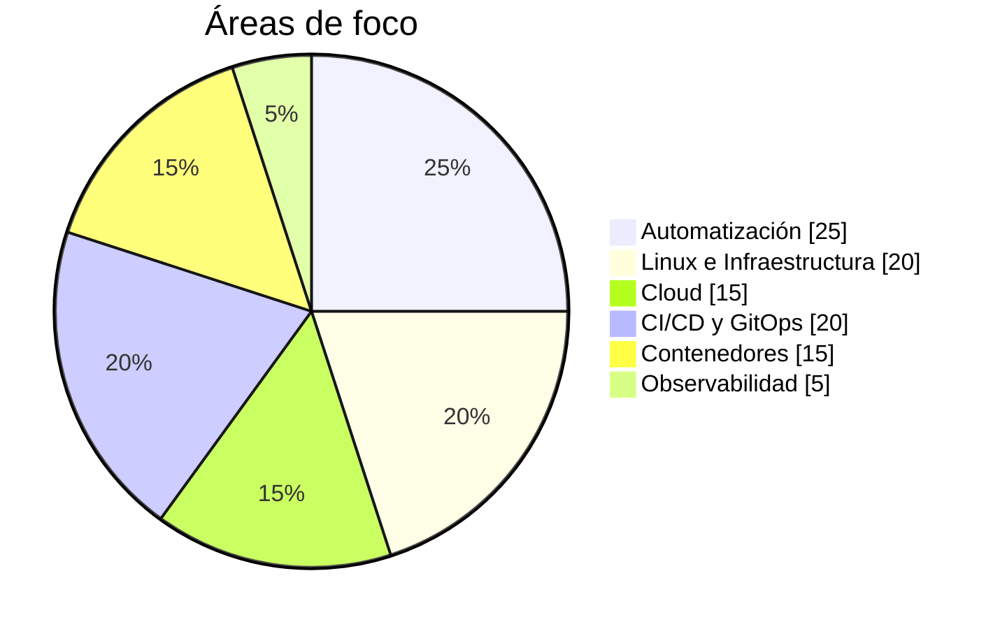

# Carlos Iturria

### `DEVOPS ENGINEER`

```text
╔════════════════════════════════════════════════════╗
║  CARLOS.ITURRIA                                   ║
║                                                    ║
║  ROLE    > DevOps Engineer                        ║
║  BASE    > Uruguay                                ║
║  FOCUS   > Linux / Cloud / Automation / CI-CD     ║
║  STATUS  > ONLINE                                 ║
╚════════════════════════════════════════════════════╝
```

> DevOps Engineer & SysAdmin con foco en infraestructura, automatización y entornos productivos.

Me interesa especialmente encontrar procesos manuales y convertirlos en soluciones **automatizadas, repetibles, trazables y mantenibles**.

---

## `> system.info`

```text
OS............. Linux / RHEL / Windows Server
CLOUD.......... AWS / Azure
AUTOMATION..... Ansible / AWX / n8n
IaC............ Terraform
CONTAINERS..... Docker / Kubernetes
CI/CD.......... GitLab CI/CD / Azure DevOps
GITOPS......... ArgoCD
SCRIPTING...... Python / Bash / Javascript / Php / GO
MONITORING..... Zabbix / Grafana / ELK
IDENTITY....... Active Directory / M365 / Keycloak
VIRTUALIZATION. VMware / Proxmox
DATABASES...... Oracle / MySQL / DB2
```

---

## `> focus --visual`

Distribución orientativa de las áreas en las que centro mi trabajo:



---

## `> automation.pipeline`

```text
┌──────────────┐
│ PROCESO      │
│ MANUAL       │
└──────┬───────┘
       │
       ▼
┌──────────────┐
│ IDENTIFICAR  │
│ LA LÓGICA    │
└──────┬───────┘
       │
       ▼
┌──────────────┐
│ AUTOMATIZAR  │
└──────┬───────┘
       │
       ▼
┌──────────────┐
│ VALIDAR      │
└──────┬───────┘
       │
       ▼
┌──────────────┐
│ MONITOREAR   │
└──────────────┘
```

```python
if tarea.es_repetitiva():
    automatizar(tarea)
```

---

## `> tech.stack`


---

## `> infrastructure.map`

```text
                         ┌─────────────┐
                         │    GIT      │
                         └──────┬──────┘
                                │
                                ▼
                         ┌─────────────┐
                         │    CI/CD    │
                         └──────┬──────┘
                                │
                 ┌──────────────┴──────────────┐
                 ▼                             ▼
          ┌─────────────┐               ┌─────────────┐
          │ TERRAFORM   │               │ ANSIBLE/AWX │
          └──────┬──────┘               └──────┬──────┘
                 │                             │
                 └──────────────┬──────────────┘
                                ▼
                       ┌─────────────────┐
                       │ INFRASTRUCTURE  │
                       └────────┬────────┘
                                │
                    ┌───────────┴───────────┐
                    ▼                       ▼
               ┌─────────┐            ┌──────────┐
               │  CLOUD  │            │ ON-PREM  │
               └────┬────┘            └────┬─────┘
                    │                      │
                    └──────────┬───────────┘
                               ▼
                      ┌────────────────┐
                      │ OBSERVABILITY  │
                      └────────────────┘
```

---

## `> contact`

[LinkedIn](https://www.linkedin.com/in/carlos-iturria/) · [GitHub](https://github.com/citurria24)

```text
C:\> whoami
Carlos Iturria

C:\> role
DevOps Engineer

C:\> focus
Automate > Standardize > Monitor > Improve
```
